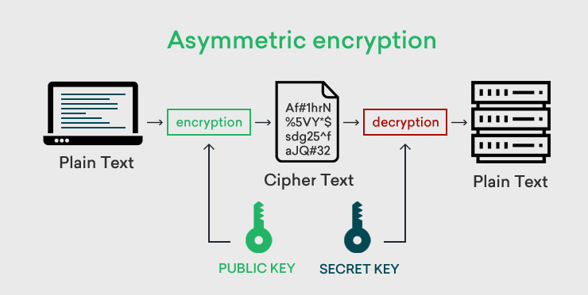
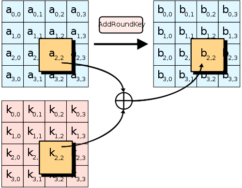
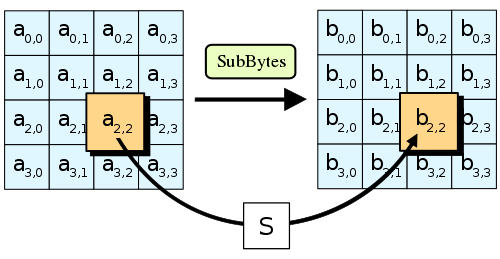
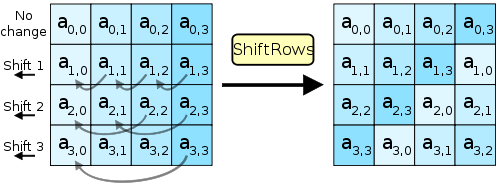
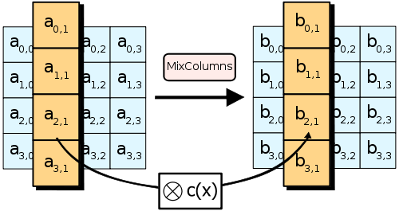
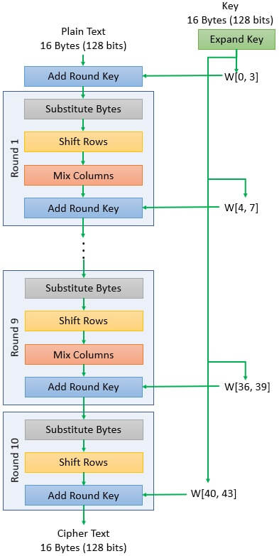

---  
# 压缩包加密与安全分析
---  

# 一、压缩包为何需要加密？  
- **常见用途**：数据传输、备份、防止信息泄露  
- **加密的重要性**：压缩包常存放敏感信息（密码、文档、源代码）  
- **主要攻击面**：  
  - 密码暴力破解  
  - 已知明文攻击  
  - 中间人攻击  
---  

## 二、压缩文件加密的基本原理  

<v-switch>

<template #1>

### 对称加密  
- **对称加密**：同一密钥用于加/解密 

**分类**:

1. 流密码逐比特（通常是逐字节）地或逐字母（替换密码）加密消息。例如ChaCha20。易被使用频率分析解密。

2. 分组密码采用多个位并将其加密为单个单元，填充明文以达到块大小的倍数。高级加密标准 (AES) 算法使用128位块。 


  

</template>

<template #2>

### 密钥派生（KDF） 
**Key Derivation Function**：  

**作用**: 把用户输入的密码（通常较短）转换为加密算法所需的安全密钥（通常较长）。

增加安全性，防止暴力破解。

**PBKDF2(基于密码的密钥派生函数2)**：  
-**工作流程**:
  - 输入：密码 + 随机**盐值(salt)**  
  - 迭代多轮哈希（HMAC-SHA1 / HMAC-SHA256）--每一轮都使用上一次的输出作为输入  
  - 输出：一个固定长度的加密密钥 → 增加暴力破解成本 (比如256位密钥用于AES-256)  

-**目的**:  
  - 增加破解难度：迭代次数越多，尝试每个密码的时间越长 
  - 防止字典攻击：即使密码相同，盐值不同，输出密钥也不同
  - 提高安全性：使用随机盐值，防止彩虹表攻击

这个整个过程称作**密钥拉伸(Key Stretching)**。

</template>

</v-switch>

---
layout: image-right
image: /assest/2.png
---

### AES(高级加密标准)
- **类型**：分组密码（block cipher）。

- **加密单元**：每次处理128位（16字节）数据。

- **密钥长度**：支持128位、192位、256位三种密钥长度。常见的是AES-256（即密钥长度为256位）。

- **工作模式**：AES本身只是一个"块加密器"，需要搭配模式来处理超过一个数据块的加密，常见有：

  -  **CBC模式（Cipher Block Chaining，加密块链接模式）**：每个明文块与前一个密文块异或后再加密，需要一个初始向量（IV）。

  -  **CTR模式（Counter Mode，计数器模式）**：把加密器当成伪随机数生成器，用生成的伪随机数流与明文异或，不需要填充（padding），适合并行处理。


---

### AES加密流程

AES加密过程是在一个**4×4**的字节矩阵上运作，这个矩阵又称为“**体（state）**”，其初值就是一个明文区块（矩阵中一个元素大小就是明文区块中的一个Byte）。

重复回数:
- AES-128: 10轮
- AES-192: 12轮
- AES-256: 14轮

加密时，各轮AES加密循环（除最后一轮外）均包含4个步骤： 

<v-switch>

<template #1>

**AddRoundKey(轮密钥加)**步骤

回合密钥将会与原矩阵合并。在每次的加密循环中，都会由主密钥产生一把轮密钥（通过Rijndael密钥生成方案产生），这把密钥大小会跟原矩阵一样，以与原矩阵中每个对应的字节作异或（⊕）加法。


</template>

<template #2>

**SubBytes(字节代换)**步骤

矩阵中各字节被固定的8位查找表(S-box)中对应的特定字节所非线性替换,$S(b_ij) = S(a_ij)$.



</template>

<template #3>

**ShiftRows(行移位)**步骤
矩阵中每一列的各个字节循环向左方位移。位移量则随着列数递增而递增。


</template>

<template #4>

**MixColumns(列混合)**步骤

每一列的四个字节透过线性变换互相结合。每一列的四个元素分别当作  $ 1,x,x^{2},x^{3}$ 的系数，合并即为 $GF(2^{8})$中的一个多项式，接着将此多项式和一个固定的多项式 $c(x)=3x^{3}+x^{2}+x+2$ 在模 $x^{4}+1$下相乘。



</template>

<template #5>



</template>


</v-switch>


---  

# 三、主流压缩包格式的加密机制  
---  

## 1. ZIP 格式  
### 1.1 传统 ZipCrypto  

传统Zip2.0加密（ZipCrypto）：使用自定义的弱加密算法（基于CRC校验），密钥强度较低。此模式易受已知明文攻击和暴力破解的影响，安全性非常有限​。例如，已知Biham与Kocher提出的已知明文攻击能够快速恢复密码​。历史上WinZip旧版本的伪随机数生成器曾存在漏洞（CVE-2001），在包含至少5个文件的ZIP中几乎可以100%破解密码​。因此不应依赖传统Zip2.0的加密机制

- **算法类型**：自定义流加密，基于 CRC32  
- **核心运算**：  
  ```  
  C = P ⊕ get_byte_from_key()  
  key₀ = CRC32(key₀, P)  
  key₁ = (key₁ + key₀) × 134775813 + 1  
  key₂ = CRC32(key₂, key₁ ≫ 24)  
  ```  
- **安全性**：易受已知明文攻击 & 暴力破解  

### 1.2 WinZip AES 加密（AE-1/AE-2）  

WinZip AES加密（AE-1/AE-2规范）：使用AES-256，在CTR模式下加密文件内容​。采用PBKDF2（基于HMAC-SHA1）对密码进行派生，迭代1000次​；输入为用户密码和16字节随机盐，输出32字节AES密钥和密码验证值。加密过程还包含一个2字节的验证值和2字节的校验码，用于密码错误时快速检测​。总的来说，ZIP-AES的流程：密码+16B盐 → PBKDF2迭代1000次 → 生成AES-256密钥 → CTR模式加密数据​。相较传统ZipCrypto，AES扩展大幅增加了破解难度

- **算法**：AES-256 + CTR 模式  
- **KDF**：PBKDF2(HMAC-SHA1), 迭代 1000 次，Salt=16B  
- **流程**：  
  1. 密码 + 16B 盐 → PBKDF2 → 32B AES 密钥 + 验证值  
  2. AES-CTR 加密数据  
- **特点**：2B 验证值 + 2B 校验码 → 快速密码检测  
---  

## 2. 7z (7-Zip) 格式  
7-Zip采用AES-256-CBC加密模式加密文件内容​。其密钥派生使用SHA-256哈希进行迭代运算：默认迭代次数为2^19（524288）次​
。有趣的是，7z默认不使用额外盐值（盐值默认为0）​，导致相同密码在不同档案中生成相同密钥。加密时还可选择对文件头进行加密（带密码时默认加密标头）。因此，7z的流程大致为：密码→ UTF-16LE编码，然后与计数器（8字节，按小端递增）按SHA-256算法进行524288轮哈希，得到AES密钥；再以CBC模式（IV为8字节全0填充）加密数据和头部​。文档中应明确7z使用CBC模式且缺省无盐的实现细节，以免误解其安全性来源。

- **算法**：AES-256 + CBC 模式  
- **KDF**：PBKDF2(HMAC-SHA256), 迭代 2¹⁹ (524 288) 次  
- **实现细节**：  
  - 默认 **无额外盐**（Salt=0）→ 相同密码同一密钥  
  - 可选 **头部加密**  
- **流程**：  
  1. 密码 → UTF-16LE → 524 288× SHA-256 → 得到 AES 密钥  
  2. IV = 8B 全 0 → AES-CBC 加密内容 & 头部  
---  

## 3. RAR5 格式  
用AES-256-CBC加密，密钥通过PBKDF2-HMAC-SHA256生成。默认迭代次数为2^15（32768）轮，然后额外做16轮用于HashKey、16轮用于Password Check，总计约32800次SHA-256运算​。派生时使用16字节的盐值，输出32字节的AES密钥；文件头中还包含“密码校验值”（Password Check），可快速验证密码正确与否。最终用得到的密钥和记录中的IV（填充0）以CBC模式加密内容​。RAR5在解密前会先验证密码，因此能比RAR3更快速地拒绝错误密码。总体流程：密码+16B盐→ PBKDF2(HMAC-SHA256) 2^15迭代→ 生成AES-256密钥+IV/Check→ CBC解密数据

- **算法**：AES-256 + CBC 模式  
- **KDF**：PBKDF2(HMAC-SHA256), 迭代 ≈ 2¹⁵ (32 768) + 校验轮次  
- **Salt**：16B；输出 32B 密钥 + IV + Password Check  
- **流程**：  
  1. 密码 + 16B 盐 → PBKDF2 32 × SHA-256 → 得到密钥/IV/校验值  
  2. 验证密码 → AES-CBC 解密数据  
---  

# 四、加密性能对比  
| 格式  | KDF(迭代次数)      | 算法       | 模式   | 头部加密 | 相对破解难度 |  
| ----- | ----------------- | ---------- | ------ | -------- | ------------ |  
| ZIP   | PBKDF2-SHA1 (1 000)  | AES-256    | CTR    | 否       | 低           |  
| 7z    | PBKDF2-SHA256 (524 288) | AES-256    | CBC    | 可选     | 高           |  
| RAR5  | PBKDF2-SHA256 (≈32 768+) | AES-256    | CBC    | 是       | 高           |  

> *迭代次数越多，破解成本越高；CPU/GPU 破解速率随之下降。*  
---  

# 五、对抗攻击方式  

- 攻击技术：常见暴力破解和密码喷射（针对弱口令）是主要方法。已知明文攻击对传统ZipCrypto特别有效​；彩虹表等针对无盐哈希在只用于验证场景时有优势。现实中还可能利用侧信道或实现漏洞，如提取错误的加密参数。

- 实际工具：知名工具包括John the Ripper（可以通过zip2john/rar2john提取哈希）与Hashcat（支持ZIP/7z/RAR等多种模式），使用字典、掩码或规则进行暴力破解；专用工具如fcrackzip（ZIP暴力/字典破解）和rarCrack（RAR暴力破解）；bkcrack则实现了对旧版ZIP的Biham–Kocher已知明文攻击​。这些工具原理上都是首先获取加密压缩包的密码散列（或者明文-密文对），然后离线尝试密码。大型商业工具（如Elcomsoft Distributed Password Recovery）还支持GPU加速和集群运算，可显著提高破解速度。

- 实现漏洞攻击：如WinZip RNG漏洞可无须已知文件直接破解ZIP​；还有部分开源实现未正确使用盐（如7z默认盐为0​），导致相同密码多文件共用密钥，可能降低攻击成本。此外，应警惕“头部泄露”：如果解压软件在密码错误时泄露部分明文或校验信息，可能为破解提供线索。

- **暴力破解**：高迭代可抑制速度  
- **字典/规则攻击**：弱口令仍易被破解  
- **已知明文攻击**：传统 ZipCrypto 高危  
- **并行加速**：GPU/FPGA 提升破解速率  
- **实现漏洞**：无盐、RNG 漏洞、头部泄露 → 降低安全性  
---  

# 六、实践建议与总结  
防御建议：使用强口令和安全格式是首要防线。应避免使用传统ZIP加密，优先选择7z或RAR5等带有强PBKDF2拉伸和随机盐的格式​；设置足够复杂的密码（高熵、长位数），并最好不同档案使用不同密码以防串联攻击；加密时尽量让所有文件（包括头部）都参与加密，避免预留已知内容作为攻击点。开发时使用现代加密库，并对旧格式漏洞保持更新修补。最后，可加用多因素加密（如将压缩档放入专门的加密容器中）增加安全冗余。

1. **拒绝 ZipCrypto**，优先选用 7z 或 RAR5  
2. 使用**高熵口令**（≥12 位，大写+小写+符号）  
3. **启用头部加密**，隐藏元数据  
4. 适当提升 KDF 迭代次数（根据性能权衡）  
5. 定期更新工具，修补已知漏洞  
---  

# 七、演示建议  
- **7-Zip 加密演示**：  
  - 设置密码 & 启用头部加密  
- **Hashcat 破解演示**：  
  - 模拟弱密码 ZIP / 7z 文件的破解过程  
